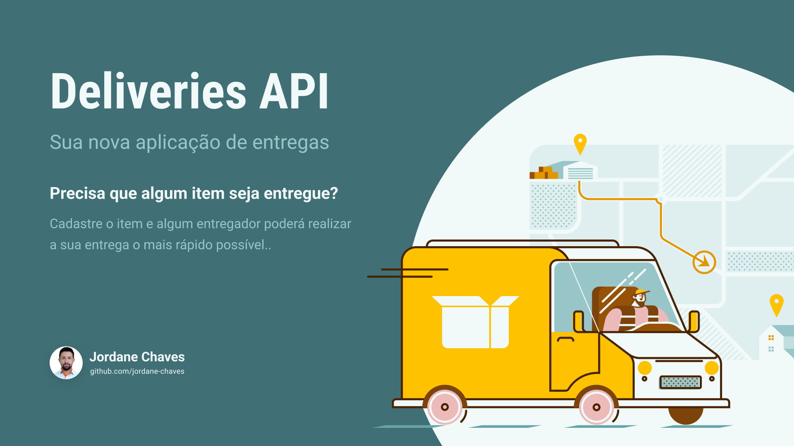

<h1 align="center">🚚 Deliveries API</h1>

<p align="center">Back-end de uma aplicação de entregas</p>

<p align="center">
  <a href="#-projeto">Projeto</a>&nbsp;&nbsp;&nbsp;|&nbsp;&nbsp;&nbsp;
  <a href="#-tecnologias">Tecnologias</a>&nbsp;&nbsp;&nbsp;|&nbsp;&nbsp;&nbsp;
  <a href="#-executando-a-aplicação">Executando a aplicação</a>&nbsp;&nbsp;&nbsp;|&nbsp;&nbsp;&nbsp;
  <a href="#-licença">Licença</a>&nbsp;&nbsp;&nbsp;|&nbsp;&nbsp;&nbsp;
  <a href="#autor">Autor</a>
</p>

<p align="center">
  
</p>

<br />

<p align="center">
  
</p>

## 💻 Projeto

Deliveries API é uma aplicação onde possui dois tipos de usuário, o cliente e o entregador.

O cliente pode cadastrar itens para serem entregues, listar, editar e/ou apagar.

O entregador poderá listar todos os itens disponíveis, escolher determinado item para realizar a entrega, listar os itens já escolhidos e marcar um item como entregue.

Quando o entregador marcar o item como entregue, o cliente recebe uma notificação informando-o que a entrega foi concluída.

Foi um projeto muito interessante de desenvolver, pois consegui aplicar diversos conceitos como:

- DDD
- Repository Pattern
- Testes unitários
- Testes E2E
- SOLID
- Clean Code
- Clean Architecture
- Entre muitos outros...

## 🚀 Tecnologias

Esse projeto foi desenvolvido com as seguintes tecnologias:

- [Node.js](https://nodejs.org/)
- [TypeScript](https://www.typescriptlang.org/)
- [NestJS](https://nestjs.com/)
- [Vitest](https://vitest.dev/)
- [Prisma](https://prisma.io/)
- [Docker](https://docker.com/)
- [Postgres](https://www.postgresql.org/)
- [JWT](https://jwt.io/)

## 🎲 Executando a aplicação

1. Clone este repositório
2. Instale as dependências

   ```bash
   npm install
   ```

3. Crie uma cópia do arquivo `.env.example` e renomeie para `.env`
4. Preencha todas as variáveis do arquivo `.env`, que foi copiado no passo anterior

   > As variáveis `JWT_PRIVATE_KEY` e `JWT_PUBLIC_KEY` precisam ser preenchidas respectivamente com as chaves RSA privada e pública, criptografadas em base64.
   > Se tiver dúvidas de como gerar estas chaves, pesquise por `generate RSA key online` e `base64 encode` para gerar as chaves sem muitas dificuldades.

   > OBS.: Em ambiente de produção não é aconselhável utilizar as chaves que foram geradas online.

5. Inicie o container do banco de dados

   ```bash
   docker-compose up -d
   ```

6. Crie todas as tabelas no banco de dados

   ```bash
   npx prisma migrate dev
   ```

7. Inicie o servidor

   ```bash
    npm run start:dev
   ```

## 📝 Licença

Esse projeto está sob a licença MIT.

## Autor


<br>

Feito com 💜 por Jordane Chaves
