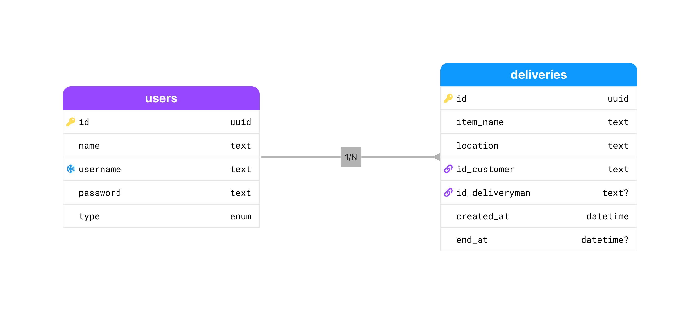

<h1 align="center">Backend de Entregas</h1>

## 💻 Projeto

Backend em Node.js utilizando o PrismaIO para interagir com o banco de dados.

Nesta aplicação, temos de um lado o cliente que irá se cadastrar e cadastrar itens para serem entregues em determinada localização, e do outro, o entregador que poderá pegar ou não determinada entrega para ser realizada.

O foco deste projeto foi praticar a integração do PrismaIO com banco de dados, porém aproveitei para adicionar alguns testes unitários e end-to-end para praticar um pouco.

## 🛠️ Tecnologias e Ferramentas

Algumas tecnologias e ferramentas envolvidas no projeto:

- [Node.js](https://nodejs.org/en/)
- [Typescript](https://www.typescriptlang.org/)
- [Express](https://expressjs.com/)
- [Docker](https://www.docker.com/)
- [Jest](https://jestjs.io/)
- [Postgres](https://www.postgresql.org/)
- [Prisma IO](https://prisma.io/)
- [JWT](https://jwt.io/)

## 🎲 Rodando a Aplicação

### Testes

1. Clone este repositório.
2. Instale as dependências com `yarn`
4. Preencha todas as informações do arquivo `.env.testing`
5. Execute o banco de dados com `docker-compose up -d`
6. Para executar os testes unitários digite `yarn test` e para executar os testes end-to-end digite `yarn test:e2e`

> OBS.: Para o teste end-to-end funcionar é necessário criar a tabela para armazenar os testes no banco de dados e informar o nome dela na variável `DATABASE_NAME` que se encontra no arquivo `.env.testing`.

### Servidor em ambiente de Desenvolvimento

1. Clone este repositório.
2. Instale as dependências com `yarn`
3. Crie uma cópia do arquivo `.env.example` e renomeie para `.env`
4. Preencha todas as informações do arquivo `.env`
5. Execute o banco de dados com `docker-compose up -d`
6. Inicie o servidor com `yarn dev`

## Autor

 

Feito com 💜 por Jordane Chaves
